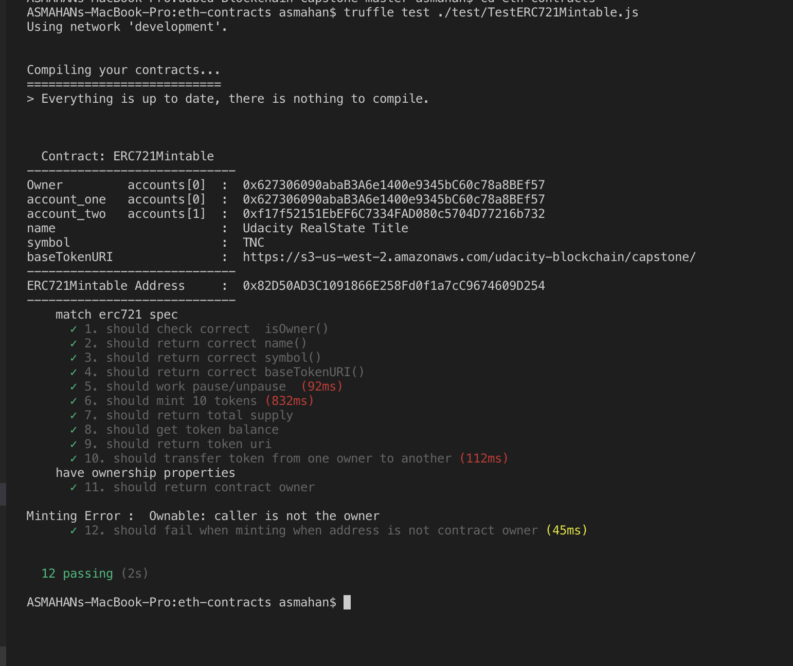
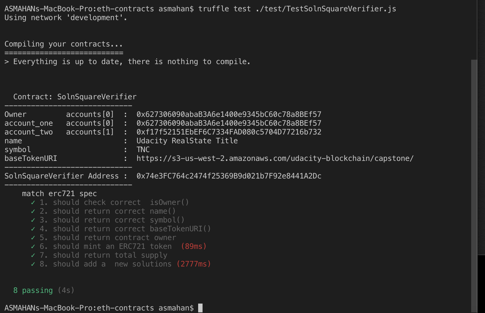
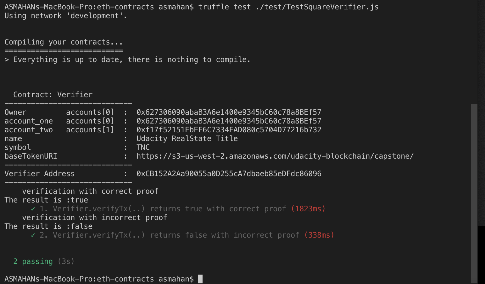
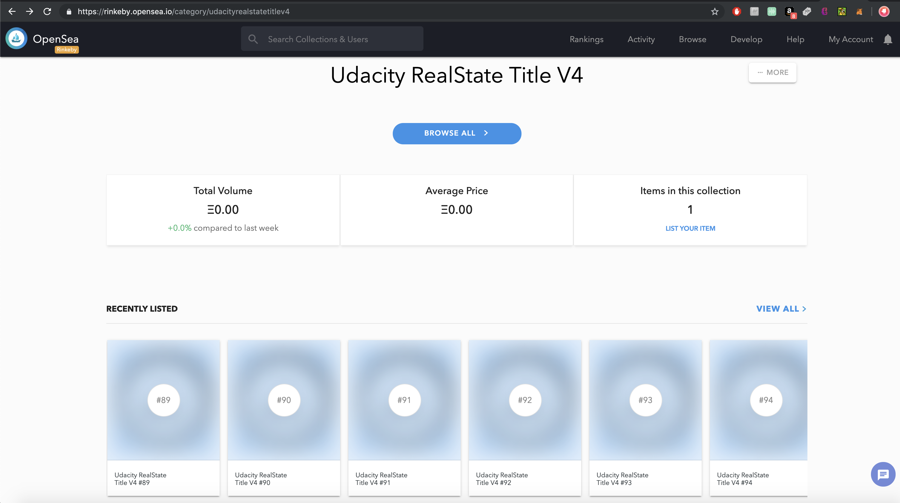

# Blockchain Developer Nanodegree [](https://www.udacity.com/blockchain)

# Udacity Blockchain Capstone
This is a sample application for Udacity's Blockchain course. 

## Getting Started

## Installing

```
#### Install required node packages 
Change to project folder and install all requisite npm packages (as listed in ```package.json```):

```
npm install
```

#### Open a  terminal window and Launch Ganache:
If you are using ganache-cli use this command to add 40 funded accounts:
```
ganache-cli -p 8545 -m "candy maple cake sugar pudding cream honey rich smooth crumble sweet treat" --gasLimit 300000000 --gasPrice 20000000000 -a 40

```

#### Open a separate terminal window and  compile smart contracts:
cd eth-contracts
```
truffle compile
```

This will create the smart contract artifacts in folder ```./build/contracts```.

#### Migrate smart contracts to the locally running blockchain, ganache-cli:
Change to the folder ```eth-contracts``` 
```
truffle migrate --reset
```
This will :
  - deploy the smart contract artifacts to running Ganache 
 
#### Test smart contracts:
Change to the folder ```eth-contracts``` 
```
truffle test ./test/TestERC721Mintable.js 
```



```
truffle test ./test/TestSolnSquareVerifier.js  
```




```
truffle test ./test/TestSquareVerifier.js  
```




#### Deploying contracts to rinkeby
###### Following contracts are deployed to rinkeby for this project:
* Deploying 'ERC721Mintable'
```
    contract address:    0x35431BD72eB4d7aB058a60bf7bC7eA909eeB89cA
```
* Deploying 'Verifier'
```
    contract address:    0x57836AcAA4bcD4F514AC06D3202ff96D9669dEE9
```
* Deploying 'SolnSquareVerifier'
```
    contract address:    0xc6d18338449A7173fDC1887507b3E23dCfD15B20
```

You can even check out the source code for this smart contract by rinkeby etherscan:
  [SolnSquareVerifier](https://rinkeby.etherscan.io/address/0xc6d18338449A7173fDC1887507b3E23dCfD15B20).
  
###### To deploy your contracts with truffle:
You should set Infura API key and metamask mnemonic as environment variables when running the truffle ( s. truffle-config.js) .
Change to the folder ```eth-contracts``` 
*  get an Infura API key
*  get metamask mnemonic
*  Open a  terminal window and run following commands
```
export INFURA_KEY="<your_infura_key>"
export MNEMONIC="<metamask>"
export NETWORK="rinkeby"
truffle migrate --network rinkeby --reset
```

#### Mint tokens
###### For this project :
```
 10 tokens are minted

1.  Minted token. Transaction: 0x672055ae7391eafdf6a4c6aaedb50a31f6f0a5579d732a70cd46ea4ef35fc9c0
2.  Minted token. Transaction: 0x1b412ef97784e680200be8c79c62bdad4817d62e3d07c958155a911da9ffaf22 
3.  Minted token. Transaction: 0x362e1ab0cb3b0c02754d50002616d5675c62be2ca711cc492c9a45cbbf2f99a3
4.  Minted token. Transaction: 0x4e10490573f314348b1e2a7d9578534485f0978b1315cf188343a0dd5de0efd8
5.  Minted token. Transaction: 0x4cef0fcfa7c83ca8ef073b3b5f03c580888b9a237de121d269b91ddcfe38080b
6.  Minted token. Transaction: 0x2a059b3f30cb5dd9b8c1b61b5b405844653bb708d6d81732f2cdc09427c70058 
7.  Minted token. Transaction: 0x9a689ded221286a6a2c1ef80f7f0f72f81adfae34be9dcd69c997e6021db6707
8.  Minted token. Transaction: 0x0923bcfd549d1886efd50d9e267dd4011d534b24fccdc9c3a1878bef895b2626
9.  Minted token. Transaction: 0x1aa456eac5563621411c995d4b69ed3d9bedd436870104ddd04fea0f594e75ae 
10. Minted token. Transaction: 0xc205d4da527a099bc66b3483030a5d96e59586ede70a7cbbf51b39eff8bdd57a

```
#### Generate Storefront on OpenSea marketplace:
OpenSea has a Rinkeby environment that allows developers to test their integration with OpenSea. 
This can be found at rinkeby.opensea.io. 

    https://rinkeby.opensea.io/get-listed/step-two

By using <contract_address> (SolnSquareVerifier), we should be able to use our contract  on OpenSea. 
Deployed contract to rinkeby is :  'SolnSquareVerifier'
```
    contract address:    0xc6d18338449A7173fDC1887507b3E23dCfD15B20
```

Your terminal should look something like this:


#### Test and Verify OpenSea with  SolnSquareVerifier tokens:

https://rinkeby.opensea.io/category/udacityrealstatetitlev4


## Built With

* [Ethereum](https://www.ethereum.org/) - Ethereum is a decentralized platform that runs smart contracts
* [Truffle Framework](http://truffleframework.com/) - Truffle is the most popular development framework for Ethereum with a mission to make your life a whole lot easier.
* [ZoKrates](https://github.com/Zokrates/ZoKrates) - Implement zkSnarks using ZoKrates, a toolbox for zkSNARKs on Ethereum.
* [Docker](https://docs.docker.com/install/) - Docker is the recommended way to get started with Zokrates. Docker is a tool designed to make it easier to create, deploy, and run applications by using containers.
* [OpenSea](https://docs.opensea.io/docs) - OpenSea is a decentralized marketplace that is used for selling for crypto assets
* [Infura](https://infura.io/) - Scalable Blockchain Infrastructure
* [Metamask](https://metamask.io/) - MetaMask is a bridge that allows to visit the distributed web in browser.

## Acknowledgments
* Solidity
* Ganache-cli
* Truffle
* JavaScript
* Node
* Ethereum
* Blockchain

# Project Resources
* [How does Ethereum work anyway?](https://medium.com/@preethikasireddy/how-does-ethereum-work-anyway-22d1df506369)
* [Remix - Solidity IDE](https://remix.ethereum.org/)
* [Visual Studio Code](https://code.visualstudio.com/)
* [Truffle Framework](https://truffleframework.com/)
* [Ganache - One Click Blockchain](https://truffleframework.com/ganache)
* [Open Zeppelin ](https://openzeppelin.org/)
* [Interactive zero knowledge 3-colorability demonstration](http://web.mit.edu/~ezyang/Public/graph/svg.html)
* [Docker](https://docs.docker.com/install/)
* [ZoKrates](https://github.com/Zokrates/ZoKrates)
* [OpenSea](https://docs.opensea.io/docs)
* [Infura](https://infura.io/)
* [Metamask](https://metamask.io/)